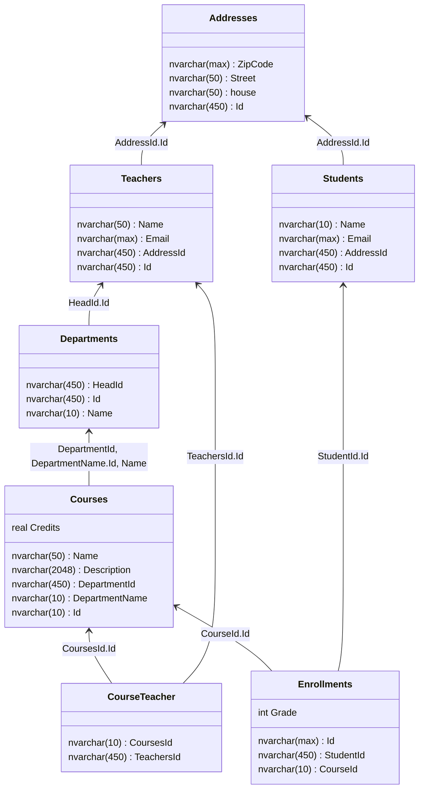

```mermaid
classDiagram
direction BT
class Addresses {
   nvarchar(max) ZipCode
   nvarchar(50) Street
   nvarchar(50) house
   nvarchar(450) Id
}
class CourseTeacher {
   nvarchar(10) CoursesId
   nvarchar(450) TeachersId
}
class Courses {
   nvarchar(50) Name
   nvarchar(2048) Description
   real Credits
   nvarchar(450) DepartmentId
   nvarchar(10) DepartmentName
   nvarchar(10) Id
}
class Departments {
   nvarchar(450) HeadId
   nvarchar(450) Id
   nvarchar(10) Name
}
class Enrollments {
   nvarchar(max) Id
   int Grade
   nvarchar(450) StudentId
   nvarchar(10) CourseId
}
class Students {
   nvarchar(10) Name
   nvarchar(max) Email
   nvarchar(450) AddressId
   nvarchar(450) Id
}
class Teachers {
   nvarchar(50) Name
   nvarchar(max) Email
   nvarchar(450) AddressId
   nvarchar(450) Id
}

CourseTeacher  -->  Courses : CoursesId.Id
CourseTeacher  -->  Teachers : TeachersId.Id
Courses  -->  Departments : DepartmentId, DepartmentName.Id, Name
Departments  -->  Teachers : HeadId.Id
Enrollments  -->  Courses : CourseId.Id
Enrollments  -->  Students : StudentId.Id
Students  -->  Addresses : AddressId.Id
Teachers  -->  Addresses : AddressId.Id
```
